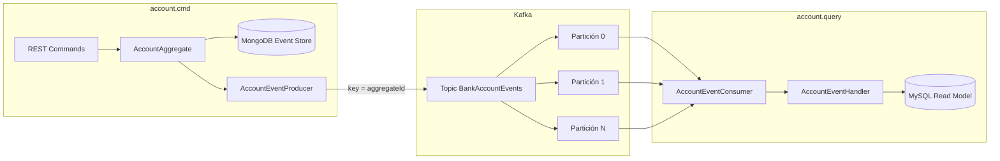

# Cambios para garantizar el orden de consumo de eventos

Documento técnico que describe **qué se modificó**, **por qué** y **cómo** el sistema garantiza que los eventos de dominio se consuman en el orden correcto al proyectar el modelo de lectura (CQRS + Event Sourcing con Kafka).

Referencia de implementación: guía *Guarantee Event Consume Order*.  
Guía de pruebas y capturas de evidencia: [PRUEBAS-ORDEN-EVENTOS.md](./PRUEBAS-ORDEN-EVENTOS.md).

---

## 1. Contexto y problema

### 1.1 Por qué importa el orden

En **Event Sourcing**, el estado de una cuenta (y su proyección en MySQL) se obtiene aplicando eventos **en secuencia**:

1. `AccountOpenedEvent` → crea la fila y el saldo inicial.  
2. `FundsDepositedEvent` → suma al saldo.  
3. `FundsWithdrawnEvent` → resta del saldo.  
4. `AccountClosedEvent` → elimina la cuenta.

Si el consumidor procesara, por ejemplo, un depósito **antes** de la apertura, `AccountEventHandler` no encontraría la cuenta o dejaría un saldo incoherente.

### 1.2 Situación anterior (sin garantía de orden global)

Antes de los cambios, el lado de **comandos** publicaba cada evento en un **topic distinto**, usando el nombre simple de la clase como nombre del topic:

```java
eventProducer.produce(event.getClass().getSimpleName(), event);
```

Eso implicaba topics separados, por ejemplo:

- `AccountOpenedEvent`
- `FundsDepositedEvent`
- `FundsWithdrawnEvent`
- `AccountClosedEvent`

En el lado de **consultas**, existían **varios métodos de consumo** (uno por tipo de evento), cada uno con su propio `@KafkaListener` apuntando a su topic.

**Consecuencias:**

| Aspecto | Comportamiento anterior |
|--------|-------------------------|
| Offset de Kafka | Cada topic tiene su **propio** offset; no hay una secuencia única compartida. |
| Replay (`restoreReadDb`) | Al republicar desde MongoDB, los eventos llegan a colas distintas; el consumidor puede intercalar tipos de forma distinta entre ejecuciones. |
| Orden entre tipos | No hay garantía de que “abrir cuenta” se procese antes que “depositar” para la misma cuenta. |
| Depuración | Varios listeners y varios offsets dificultan demostrar orden en logs. |

### 1.3 Objetivo de los cambios

Centralizar el flujo de integración en **un único topic** (`BankAccountEvents`) y **un único listener**, de modo que:

- Todos los eventos compartan la misma cola lógica de Kafka.
- Durante un **replay** del event store, la secuencia publicada se refleje en **un solo stream ordenado** (por partición).
- El consumidor procese mensajes **en orden de offset** dentro de cada partición.

---

## 2. Estrategia de solución



Tres pilares:

1. **Un solo topic** — configuración `spring.kafka.topic: BankAccountEvents` en comandos y consultas.  
2. **Clave de partición = id del agregado** — en `AccountEventProducer`, `kafkaTemplate.send(topic, event.getId(), event)` agrupa todos los eventos de una misma cuenta en la **misma partición**; Kafka preserva el orden **dentro** de esa partición.  
3. **Un solo consumidor** — un `@KafkaListener` recibe `BaseEvent` y despacha por reflexión al `EventHandler.on(...)` correspondiente.

> **Nota:** Kafka garantiza orden **por partición**, no entre particiones. Con varias particiones, dos cuentas distintas pueden procesarse en paralelo, pero **los eventos de una misma cuenta** siguen ordenados gracias a la clave.

---

## 3. Cambios detallados por componente

### 3.1 Lado de comandos (`account.cmd`)

#### 3.1.1 `application.yml`

**Cambio:** propiedad centralizada del topic.

```yaml
spring:
  kafka:
    topic: BankAccountEvents
    producer:
      bootstrap-servers: localhost:29092
      key-serializer: org.apache.kafka.common.serialization.StringSerializer
      value-serializer: org.springframework.kafka.support.serializer.JsonSerializer
```

| Antes | Después |
|-------|---------|
| Sin `spring.kafka.topic`; el nombre del topic se infería del tipo de evento en código | Topic único definido en configuración |
| Bootstrap `9092` en material de curso | En este repo: `localhost:29092` (ver `docker-compose.yml`) |

#### 3.1.2 `AccountEventStore`

**Cambios:**

1. Campo inyectado desde configuración:

```java
@Value("${spring.kafka.topic}")
private String topic;
```

2. Publicación al topic unificado al persistir en MongoDB:

| Antes | Después |
|-------|---------|
| `eventProducer.produce(event.getClass().getSimpleName(), event)` | `eventProducer.produce(topic, event)` |

El versionado optimista (`event.setVersion(version)`) se mantiene; la versión viaja en el payload y permite validar orden lógico en logs y en el agregado.

#### 3.1.3 `AccountEventSourcingHandler`

**Cambio:** en `republishEvents()` (usado por `POST /api/v1/restoreReadDb`), cada evento del event store se republica al **mismo** topic:

```java
@Value("${spring.kafka.topic}")
private String topic;

// ...
for (var event : events) {
    eventProducer.produce(topic, event);
}
```

| Antes | Después |
|-------|---------|
| Republicación a topics por nombre de clase | Republicación secuencial al stream `BankAccountEvents` |

Así, al reconstruir la base de lectura, el consumidor lee **una sola secuencia de offsets** (por partición) en lugar de reconciliar cuatro colas independientes.

#### 3.1.4 `AccountEventProducer` (clave de mensaje)

El productor envía el evento con **clave** = id del agregado (`event.getId()`):

```java
@Override
public void produce(String topic, BaseEvent event) {
    this.kafkaTemplate.send(topic, event.getId(), event);
}
```

| Parámetro | Valor | Efecto |
|-----------|--------|--------|
| Topic | `BankAccountEvents` | Un stream compartido |
| Key | UUID de la cuenta | Misma partición para todos los eventos de esa cuenta |
| Value | `BaseEvent` (JSON) | Tipo concreto deserializado en el consumidor |

Sin clave (o con claves aleatorias), con varias particiones Kafka podría repartir los eventos de **una misma cuenta** en particiones distintas y **romper** el orden relativo.

---

### 3.2 Lado de consultas (`account.query`)

#### 3.2.1 `application.yml`

**Cambios:**

```yaml
spring:
  kafka:
    topic: BankAccountEvents
    listener:
      ack-mode: MANUAL_IMMEDIATE
      poll-timeout: 15m          # evita timeout del consumer en depuración/replay largos
    consumer:
      bootstrap-servers: localhost:29092
      group-id: bankaccConsumer
      auto-offset-reset: earliest
      key-deserializer: org.apache.kafka.common.serialization.StringDeserializer
      value-deserializer: org.springframework.kafka.support.serializer.JsonDeserializer
```

| Propiedad | Propósito |
|-----------|-----------|
| `topic` | Mismo nombre que en `account.cmd` |
| `ack-mode: MANUAL_IMMEDIATE` | Commit del offset solo tras procesar correctamente (`ack.acknowledge()`) |
| `poll-timeout: 15m` | Tiempo amplio de poll durante replay o depuración (PDF: 900000 ms) |
| `auto-offset-reset: earliest` | Tras reinicio con grupo nuevo o sin offset, lee desde el inicio del topic |

#### 3.2.2 Interfaz `EventConsumer`

**Antes:** varios métodos `consume`, uno por tipo de evento (cuatro firmas distintas).

**Después:** un único contrato:

```java
public interface EventConsumer {
    void consume(@Payload BaseEvent event, Acknowledgment ack);
}
```

#### 3.2.3 `AccountEventConsumer`

**Antes:** varios `@KafkaListener`, cada uno en un topic distinto (`AccountOpenedEvent`, etc.).

**Después:** un listener único:

```java
@KafkaListener(
    topics = "${spring.kafka.topic}",
    groupId = "${spring.kafka.consumer.group-id}"
)
@Override
public void consume(@Payload BaseEvent event, Acknowledgment ack) {
    // log de trazabilidad
    // reflexión → EventHandler.on(ConcreteEvent)
    ack.acknowledge();
}
```

**Despacho por reflexión:**

```java
var eventHandlerMethod = eventHandler.getClass()
    .getDeclaredMethod("on", event.getClass());
eventHandlerMethod.setAccessible(true);
eventHandlerMethod.invoke(eventHandler, event);
```

`AccountEventHandler` conserva métodos tipados (`on(AccountOpenedEvent)`, etc.); solo cambia **cómo** se invocan (un punto de entrada Kafka en lugar de cuatro).

**Log añadido** para evidencia de orden:

```
[Kafka] Consumed from BankAccountEvents | type=... aggregateId=... aggregateVersion=...
```

#### 3.2.4 `AccountEventHandler`

Sin cambios estructurales en la lógica de proyección; sigue asumiendo que los eventos llegan en orden válido para el agregado.

---

## 4. Flujo end-to-end tras los cambios

### 4.1 Escritura normal (comando → Kafka → MySQL)

1. Cliente llama `POST /api/v1/openBankAccount`, `PUT depositFunds`, etc.  
2. `AccountCommandHandler` carga/guarda el agregado vía `AccountEventSourcingHandler`.  
3. `AccountEventStore.saveEvents` persiste en MongoDB y llama `produce(topic, event)`.  
4. Kafka almacena el mensaje en `BankAccountEvents`, partición = `hash(aggregateId) % numPartitions`.  
5. `AccountEventConsumer` recibe mensajes **en orden de offset** en esa partición.  
6. Se invoca el `on(...)` adecuado y se actualiza MySQL.  
7. Se hace `ack.acknowledge()`.

### 4.2 Replay / reinicio del servicio de consulta

**Escenario A — Reiniciar `account.query`:**  
El consumer group `bankaccConsumer` reanuda desde el último offset confirmado (o `earliest` si no hay offset). Los eventos se vuelven a procesar **en el mismo orden de partición**.

**Escenario B — `POST /api/v1/restoreReadDb`:**  
`republishEvents()` lee todos los agregados activos del event store y publica de nuevo al topic único. El consumidor reconstruye la proyección leyendo el stream unificado.

En ambos casos, para una cuenta concreta deben observarse tipos y versiones crecientes, por ejemplo:  
`AccountOpenedEvent (v1)` → `FundsDepositedEvent (v2)` → `FundsWithdrawnEvent (v3)` → `AccountClosedEvent (v4)`.

---

## 5. Garantías y límites

### 5.1 Qué queda garantizado

| Garantía | Mecanismo |
|----------|-----------|
| Orden por cuenta | Message key = `aggregateId` → misma partición |
| Orden de lectura en consumer | Un hilo de consumo por partición en el mismo group; procesamiento secuencial de offsets |
| Un stream para replay | Topic único + republicación al mismo topic |
| Trazabilidad | Log con `type`, `aggregateId`, `aggregateVersion` |
| Procesamiento at-least-once controlado | `MANUAL_IMMEDIATE` + ack tras handler exitoso |

### 5.2 Qué no garantiza Kafka por sí solo

- **Orden entre cuentas distintas** en particiones diferentes (no suele ser requisito de negocio).  
- **Orden global** con topic de **varias particiones** y **sin** usar key: por eso la clave en el productor es obligatoria en producción multi-partición.  
- **Consistencia inmediata** entre comando y consulta: sigue siendo **consistencia eventual**; el orden en Kafka no elimina la latencia entre servicios.

### 5.3 Recomendaciones de infraestructura

| Entorno | Particiones | Comentario |
|---------|-------------|------------|
| Laboratorio / demo | 1 | Orden global trivial en todo el topic |
| Más realista | 3+ | Orden solo por partición; **siempre** usar key = `aggregateId` |

Creación de topic (ejemplo):

```bash
kafka-topics.sh --create --topic BankAccountEvents \
  --bootstrap-server localhost:29092 \
  --partitions 3 --replication-factor 1
```

---

## 6. Resumen de archivos modificados

| Módulo | Archivo | Tipo de cambio |
|--------|---------|----------------|
| `account.cmd` | `src/main/resources/application.yml` | `spring.kafka.topic` |
| `account.cmd` | `AccountEventStore.java` | `@Value topic` + `produce(topic, event)` |
| `account.cmd` | `AccountEventSourcingHandler.java` | `@Value topic` + replay al topic único |
| `account.cmd` | `AccountEventProducer.java` | `send(topic, key, value)` con key = aggregate id |
| `account.query` | `src/main/resources/application.yml` | `topic`, `poll-timeout`, deserializers |
| `account.query` | `EventConsumer.java` | Un solo método `consume(BaseEvent, Ack)` |
| `account.query` | `AccountEventConsumer.java` | Un `@KafkaListener` + reflexión + logging |

---

## 7. Relación con otros entregables

| Documento | Contenido |
|-----------|-----------|
| **Este documento** | Diseño y cambios de código para orden de consumo |
| [PRUEBAS-ORDEN-EVENTOS.md](./PRUEBAS-ORDEN-EVENTOS.md) | Pasos de prueba, reinicio de `account.query`, capturas de logs |
| [../postman/POSTMAN.md](../postman/POSTMAN.md) | Colección Newman/Postman del flujo bancario |
| [../README.md](../README.md) | Arquitectura general CQRS + Event Sourcing |

---

## 8. Conclusión

Los cambios alinean la implementación con el patrón descrito en *Guarantee Event Consume Order*: **un topic**, **un consumidor** y **publicación centralizada** desde el event store. La **clave de partición por agregado** completa la garantía cuando el topic tiene más de una partición.

Tras aplicar estos cambios y reiniciar el replay o el servicio de consultas, la secuencia de eventos por cuenta debe ser **reproducible y verificable** en los logs del consumidor, como se detalla en la guía de pruebas enlazada arriba.
